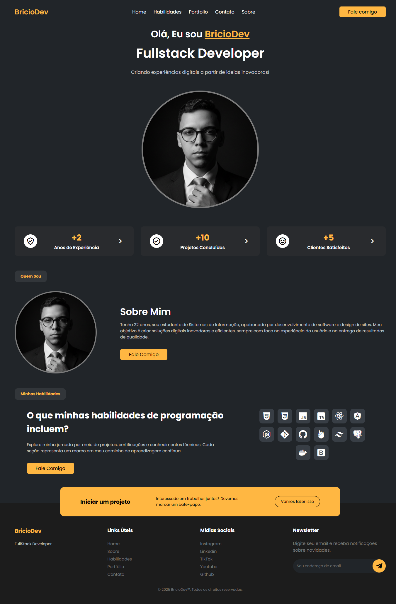

# BricioDev - Personal Portfolio
Este é o repositório do meu portfólio pessoal, desenvolvido para apresentar minhas habilidades como Fullstack Developer, meus projetos e facilitar o contato para oportunidades profissionais.

# 🚀 Tecnologias Utilizadas
O projeto foi construído utilizando tecnologias web fundamentais, focando em performance e responsividade:

HTML5: Estrutura semântica das páginas.

CSS3: Estilização personalizada, layout flexbox/grid e animações.

JavaScript (Vanilla): Lógica para o menu hambúrguer responsivo e interatividade.

Boxicons: Biblioteca de ícones vetoriais.

Google Fonts: Tipografia "Poppins" para um design moderno.

# 📂 Estrutura do Projeto
O site é organizado de forma modular para facilitar a manutenção:

/: Página inicial (Home).

/about/: Informações detalhadas sobre minha trajetória.

/skills/: Exibição das tecnologias que domino.

/portfolio/: Galeria dos meus principais projetos concluídos.

/contact/: Formulário e informações de contato.

/assets/: Imagens, logos e recursos visuais.

# ✨ Funcionalidades
Design Responsivo: Adaptado para desktops, tablets e dispositivos móveis (Mobile-first via Media Queries).

Menu Hambúrguer: Navegação intuitiva em telas pequenas controlada por JavaScript.

Formulário de Contato: Interface pronta para integração com serviços de envio de e-mail.

# 🛠️ Como executar localmente
Clone este repositório:

Bash

git clone https://github.com/bricio29/landing-page-briciodev.git
Navegue até a pasta do projeto.

Abra o arquivo index.html em seu navegador de preferência.

📧 Contato
LinkedIn: in/briciodev

Email: fabricioweslley29@gmail.com

GitHub: @bricio29

© 2025 BricioDev. Todos os direitos reservados.

# Screenshot
Aqui está uma captura de tela do projeto:

